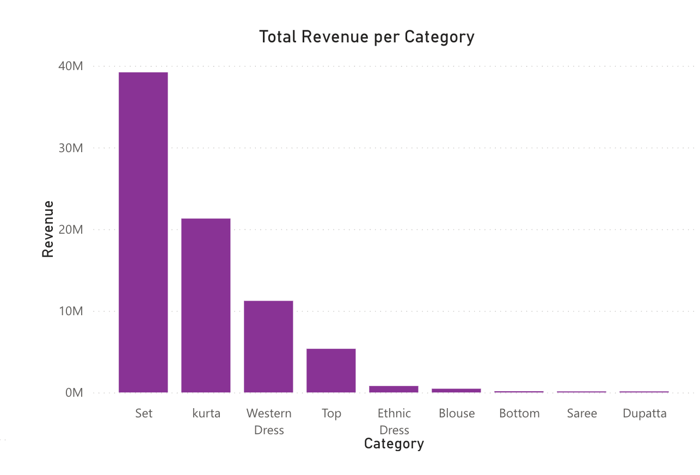
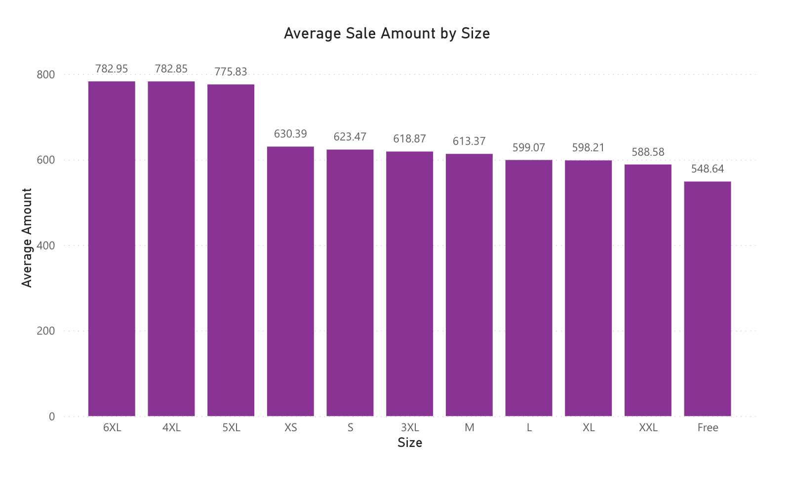
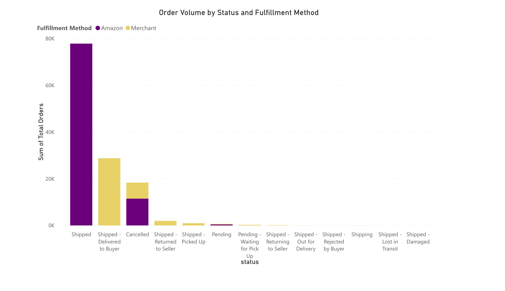
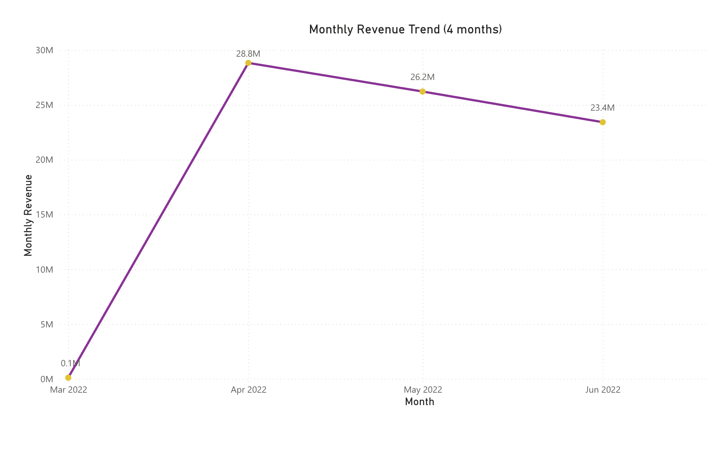

# Amazon Sales Analytics Project

## Overview
This project analyzes Amazon India (amazon.in) sales data to uncover insights on revenue, product performance, and fulfillment patterns. The dataset has been cleaned to remove most missing or invalid values.

**Dataset:** `sales_clean_sample.csv` (subset of original data) 
**Tools:** PostgreSQL (Postico), SQL, Power BI 
**Market:** India only
**Currency:** All revenue values in Indian Rupees (INR)
**Original Dataset (non-cleaned):** https://www.kaggle.com/datasets/thedevastator/unlock-profits-with-e-commerce-sales-data?select=Amazon+Sale+Report.csv

---

## Analysis & Visualizations

### 1️⃣ Total Revenue per Category

- **Goal:** Identify which product categories generate the most revenue.  
- **Visualization:** Bar chart in Power BI  
- **Insight:** The chart reveals a clear revenue hierarchy. The Saree category is the top performer by a significant margin, generating approximately ₹40M (~$444K USD). Kurta, Western Dress, and Top categories also contribute strongly as secondary revenue drivers. In contrast, Dupatta and Bottom contribute the least to overall revenue. A key factor impacting sales for certain categories is sizing standardization. Categories like Saree and Dupatta are sold by length rather than conventional S/M/L sizes, which can create purchasing hesitation in an online environment. Without the ability to see, feel, or try on the garment, buyers may lack confidence in how the item will fit, leading to lower conversion rates and sales volumes. This suggests that product presentation and trust-building elements such as detailed size charts, fabric draping videos, and customer review images could be especially impactful for these categories. Meanwhile, higher-revenue categories like Sets and Western Wear benefit from familiar sizing conventions, making them more approachable for online shoppers.

### 2️⃣ Average Sale Amount by Size/Style

- **Goal:** Compare average order value across sizes or individual SKUs.  
- **Visualization:** Clustered column chart in Power BI  
- **Insight:**When examining Amazon India's pricing by size, a clear pattern emerges: larger sizes come with larger price tags. Extended sizes (4XL–6XL) command the highest averages (₹776–782), while standard sizes (XS–M) cluster in the ₹613–639 range. The premium for plus-size items points to a market gap—less competition, higher willingness to pay, and a clear margin opportunity. Free-size products sit at the lowest price point (₹545) and are primarily made up of categories like Saree and Dupatta—garments that are traditionally sold by length measurements rather than standard S/M/L sizing. This reflects not necessarily lower value, but a different product structure in which pricing is shaped by material length, draping styles, and traditional buying patterns rather than conventional size-based competition. Interestingly, even XS carries a slight premium, likely due to lower inventory creating subtle scarcity. For sellers, the takeaway is strategic: while standard sizes drive traffic, extended sizes offer a 40–50% margin upside in a less saturated segment of the market. This isn't just about size—it's about spotting where demand outpaces supply and pricing accordingly.

### 3️⃣ Order Volume by Status and Fulfillment Method

- **Goal:** Analyze distribution of order statuses and fulfillment channels.  
- **Visualization:** Stacked column chart in Power BI  
- **Insight:** The vast majority of orders are successfully delivered through Amazon Fulfillment (FBA), which dominates order volume compared to merchant fulfillment (FBM). This reflects strong seller and buyer preference for Amazon’s logistics due to reliability and speed. While cancellations and returns are minimal, small but notable volumes of problematic statuses—such as Pending, Pending-Waiting for Pick Up areas for operational improvement. Overall, fulfillment performance is strong, but attention to these minor pain points could further enhance customer trust and retention.

### 4️⃣ Revenue Over Time

- **Goal:** Track monthly revenue trends.  
- **Visualization:** Line chart in Power BI  
- **Insight:** Monthly revenue shows a clear declining trend from April to June 2022, starting at ₹28.8M in March and falling to ₹23.4M by June. This gradual drop suggests a post-seasonal slowdown, possibly following a peak shopping period such as Holi or wedding season in early spring. The consistent month-over-month decrease may indicate reduced demand, increased competition, or a need for refreshed marketing and promotions heading into the summer months.

---

## Data Cleaning Notes
- `NULL` courier statuses were replaced with `'UNKNOWN'`.  
- Canceled orders with `NULL` amount were set to 0. Some canceled orders still show non-zero amounts.  

---

## How to Use
1. Open the `sales_clean_sample.csv` in Power BI or Excel.  
2. Run the SQL queries in the `sql` folder to reproduce the analyses.  
3. Explore the charts or add additional insights as needed.  

---

## Next Steps / Optional Enhancements
- Investigate patterns in SKUs and sizes with missing amounts.  
- Extend analysis to revenue per state or B2B vs B2C comparisons.  
- Use the full dataset for more detailed visuals (limited sample used here for GitHub upload restrictions).  

---

